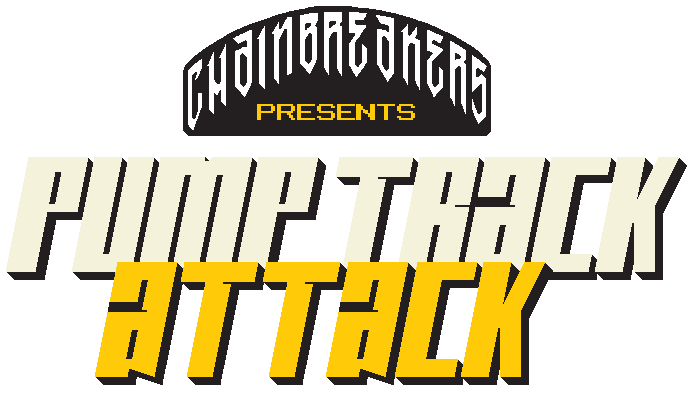

<!--
  Title: Chainbreakers' Pumptrack Attack
  Description: An Open Source video game about riding pump tracks with a mountain bike 
  Author: Ferran Pons
  -->

Open Source video game with a fancy pixel art about riding pump tracks with a mountain bike. 
This is a submission to <a href="https://itch.io/jam/game-off-2018/rate/337963">Game Off 2018</a>

 

<b><a href="#features">Features</a></b>
|
<b><a href="#download">Download</a></b>
|
<b><a href="#who-made-this">Who Made This</a></b>
|
<b><a href="#bugs-and-feedback">Bugs and Feedback</a></b>
|
<b><a href="#licensing">Licensing</a></b>

 

### Features

* Time attack
* Leaderboards
* Cool Indie Original Soundtrack
* 1 track for now
* Input: Keyboard
* Cool Pixel Art graphics
   

**IMPORTANT!: This is a work in progress project. It's possible that at any moment the project will not run or have bugs!**

### Download

For now, if you want to play this game, you can download the released (v0.1.0) for PC Windows **for free** [here](https://retrowax.itch.io/chainbreakers-pumptrack-attack).

### Requirements

If you want to build this project, this is what you are going to need:

* Python 3
* Pygame 1.9.4

Who made this
--------------

| 
|---
| [Ferran Pons](https://github.com/ferranpons)

Hi! I'm Ferran Pons; a Senior Android Developer that works for Schibsted Spain developing the Vibbo application. With almost 15 years of experience as a programmer, my experience covers a lot of different kind of applications, from web app development to the desktop, mobile apps and videogames. I've participated in some blockbuster games such as Burnout Paradise, DeadSpace and the Skate franchise. Also I've tried to start up my own indie videogame studio, labeled "Retrowax Games" with which I've made this game that it's published for the Xbox360 and Windows Phone and PC Windows.

Bugs and Feedback
-----------------

For bugs, questions and discussions please use the [Github Issues](https://github.com/ferranpons/ccc_pumptrack_attack/issues).

Licensing
---------

#### Assets

``Screw Wave`` by **Windom Earle** is licensed under a [Attribution-NonCommercial-ShareAlike 3.0 International License.](http://creativecommons.org/licenses/by-nc-sa/3.0/)

All art assets (``art`` and
``sound``) are distributed under the 

 This work is licensed under a <a rel="license" href="http://creativecommons.org/licenses/by-nc/4.0/">Creative Commons Attribution-NonCommercial 4.0 International License</a>.

#### Code

Copyright 2018 Ferran Pons

Licensed under the Apache License, Version 2.0 (the "License");
you may not use this file except in compliance with the License.
You may obtain a copy of the License at

    http://www.apache.org/licenses/LICENSE-2.0

Unless required by applicable law or agreed to in writing, software
distributed under the License is distributed on an "AS IS" BASIS,
WITHOUT WARRANTIES OR CONDITIONS OF ANY KIND, either express or implied.
See the License for the specific language governing permissions and
limitations under the License.
